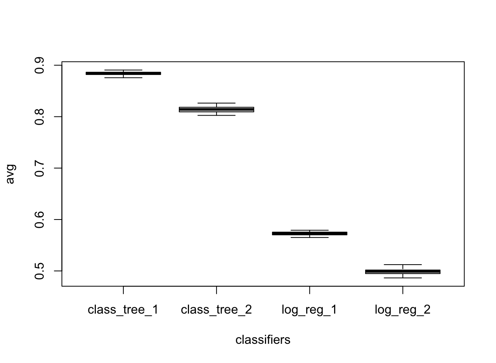

# classifying_hand_gestures
We consider the problem of classifying hand gestures by means of muscle activity recorded via electromyography
(EMG), a technique which measures the electrical activity produced by muscles beneath by means of sensors on the
skin. The task is to predict the type of gesture given the input EMG sensor data. The dataset data_hand_gest.RData contains EMG (electromyography) measurements for two types of gestures: hand closed in a fist (class 0) and open hand (class 1)

## Cross-validation 
Cross-validation could also be used to select the best classifier. Indeed, K-fold cross-validation can be used to check
which model proves better at predicting the validation data points in the dropped folds. We introduced how to split the data into training, 
validation and test sets in order to select the best classifier among a collection of competitors and evaluate its accuracy at predicting the classification of new data points.

## Data 
More information is available on this link : https://www.kaggle.com/kyr7plus/emg-4/data.
The vector y contains the target class labels, while the matrix x is the matrix of input data. The measurements are
collected in 8 consecutive readings of 8 sensors, so 64 features are available.

## Models 
We consider 4 competing models:
1. A classification tree with complexity parameter cp = 0.05.
2. A classification tree with complexity parameter cp = 0.1, hence less deep than the one in (1).
3. A logistic regression with all the 64 features related to the 8 readings for the 8 sensors.
4. A logistic regression with only the last reading of the 8 sensors, hence with 8 features.

## Result

Overall, the classification tree with complexity parameter cp = 0.05 has the better average accuracy. All models have
a low variability in the estimates, with the classification tree models having a slightly larger variability compared to
the logistic regression models.
